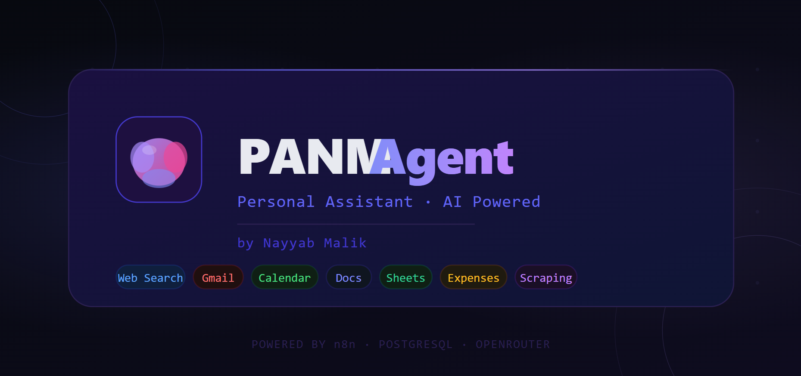

# 🧠 PANM Agent — Personal AI Assistant by Nayyab Malik

> A powerful personal AI assistant built with **n8n**, **Streamlit**, **PostgreSQL**, and **Google Gemini** — capable of web search, email management, calendar scheduling, document creation, lead scraping, and expense tracking.

---

## 📸 Workflow Overview



---

## 🚀 Features

| Capability | Description |
|---|---|
| 🔍 **Web Search** | Real-time internet search via Tavily API |
| 📧 **Gmail** | Send, read, and retrieve multiple emails |
| 📅 **Google Calendar** | Create, get, and list calendar events |
| 📄 **Google Docs** | Create, read, and update documents |
| 📊 **Google Sheets** | Manage leads sheet and expense tracker |
| 🌐 **Web Scraping** | Extract leads from websites via Firecrawl |
| 💰 **Expense Tracking** | Log and calculate expenses automatically |
| 🧠 **Persistent Memory** | PostgreSQL-backed chat memory per session |

---

## 🏗️ Architecture

```
User (Streamlit UI)
        │
        ▼
   n8n Webhook
        │
        ▼
   Edit Fields  ──►  AI Agent (Google Gemini)
                           │
              ┌────────────┼────────────┐
              ▼            ▼            ▼
        Postgres     Tavily Search   Tools:
        Chat Memory               Gmail / Calendar
                                  Google Docs / Sheets
                                  Firecrawl / Calculator
```

### Stack

- **Frontend:** Streamlit (Python)
- **Orchestration:** n8n (self-hosted)
- **AI Model:** Google Gemini (via n8n LangChain node)
- **Memory:** PostgreSQL (`memory_db`, port `5442`)
- **Search:** Tavily API
- **Scraping:** Firecrawl
- **Integrations:** Gmail, Google Calendar, Google Docs, Google Sheets

---

## 📁 Project Structure

```
PANM-Agent/
├── app.py                   # Streamlit frontend UI
├── Personal_Assistant.json  # n8n workflow (importable)
├── PANM_Agent.PNG           # Workflow diagram screenshot
└── README.md
```

---

## ⚙️ Setup & Installation

### Prerequisites

- Python 3.9+
- n8n (self-hosted, running on `localhost:5678`)
- PostgreSQL (running on port `5442`)
- Google account with OAuth credentials
- Tavily API key
- Firecrawl API key

---

### 1. Clone the Repository

```bash
git clone https://github.com/your-username/panm-agent.git
cd panm-agent
```

### 2. Install Python Dependencies

```bash
pip install streamlit requests psycopg2-binary pandas
```

### 3. Set Up PostgreSQL

Create the database used for chat memory:

```sql
CREATE DATABASE memory_db;
```

> The app connects on port **5442** with user `postgres` / password `postgres`.  
> Update the `DB_BASE` config in `app.py` if your setup differs.

### 4. Import the n8n Workflow

1. Open n8n at `http://localhost:5678`
2. Go to **Workflows → Import from file**
3. Select `Personal_Assistant.json`
4. Configure credentials for each node:
   - **Postgres** → point to your `memory_db`
   - **Google OAuth** → Gmail, Calendar, Docs, Sheets
   - **Tavily** → add your API key
   - **Firecrawl** → add your API key
   - **Google Gemini** → add your API key
5. Activate the workflow

### 5. Verify the Webhook URL

The Streamlit app posts to:

```
http://localhost:5678/webhook/b19536a2-4d87-4b1c-b6fe-da596320aa22
```

Make sure this matches the **Webhook** node URL in your n8n workflow. Update `N8N_WEBHOOK_PROD` in `app.py` if needed.

### 6. Run the Streamlit App

```bash
streamlit run app.py
```

Open your browser at `http://localhost:8501`

---

## 🧩 n8n Workflow — Node Overview

The workflow (`Personal_Assistant.json`) contains **30 nodes**:

| Node | Purpose |
|---|---|
| **Webhook** | Receives requests from Streamlit |
| **Edit Fields** | Extracts message & session ID |
| **AI Agent** | Core reasoning engine (Gemini) |
| **Postgres Chat Memory** | Stores per-session conversation history |
| **Search in Tavily** | Web search tool |
| **Gmail nodes (×3)** | Send / get one / get many emails |
| **Google Calendar (×3)** | Create / get / get many events |
| **Google Docs (×3)** | Create / read / update documents |
| **Google Sheets (×5)** | Leads sheet + expense sheet operations |
| **Firecrawl `/scrape`** | Website scraping for lead extraction |
| **Calculator** | Expense totals and arithmetic |
| **Respond to Webhook** | Sends agent response back to Streamlit |

---

## 💬 Quick Task Examples

These are built into the sidebar of the Streamlit app:

| Task | What it does |
|---|---|
| 🔍 Web Search → Sheet | Searches for a solar panel company and saves to Leads sheet |
| 📧 Gmail Summary | Fetches and summarises your latest 5 emails |
| 📅 This Week's Events | Lists all Google Calendar events for the week |
| 💰 Log Expense | Logs an expense entry to the tracker sheet |
| 🌐 Scrape → Doc | Scrapes a URL and saves summary to Google Docs |
| 🧪 Full Pipeline Test | Runs all tools in sequence end-to-end |

---

## 🔒 Security Notes

- Session IDs are SHA-256 hashed and masked in the UI (`xxxx •••• xx`)
- Gmail and Calendar tools only activate when explicitly requested
- No sensitive user data is sent externally beyond what you approve via tool use
- Credentials are stored securely inside n8n (never hardcoded)

---

## 🐛 Troubleshooting

| Issue | Fix |
|---|---|
| `Cannot connect to n8n at localhost:5678` | Make sure n8n is running and the workflow is active |
| `PostgreSQL unreachable` | Check DB is running on port 5442; see sidebar diagnostics |
| `HTTP 500 from n8n` | Open n8n Executions tab, find the red node, check credentials |
| Timeout after 120s | Check n8n Executions — the agent may still be processing |
| Google auth errors | Re-connect OAuth credentials in n8n credential settings |

---

## 🤝 Contributing

Pull requests are welcome! For major changes, please open an issue first to discuss what you'd like to change.

---

## 📄 License

MIT License — feel free to use and adapt.

---

## 👤 Author

**Nayyab Malik**  
PANM Agent — Personal AI Assistant

---

> **About adding the n8n workflow JSON to GitHub:** Yes, it is completely fine and actually recommended! The `Personal_Assistant.json` file contains no secrets — all credentials are stored inside n8n by reference ID, not as plaintext. Sharing the workflow file lets others import and run the same automation easily. Just make sure you do **not** commit any `.env` files or hardcoded API keys.
